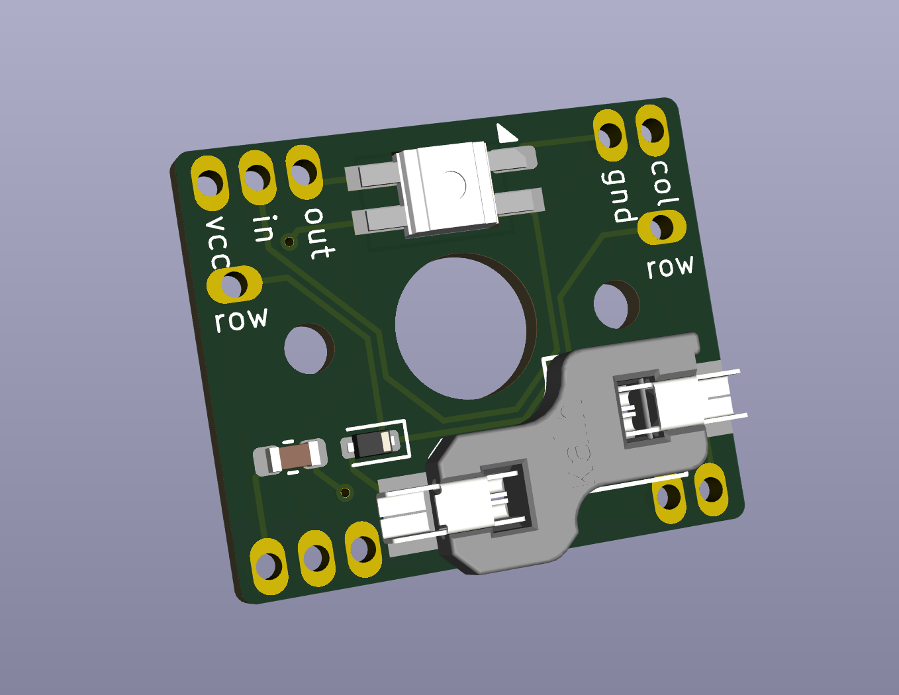

# Kailh Choc Hot Swap v1/v2

This is a tiny PCB for individual Kailh Choc mechanical switches. It's meant for
hand wiring non-flat keyboards.

- Supports both v1 and v2 Chocs
- Has a hot-swap socket
- Has an LED socket for SK6812MINIs

**WANRNING** has 0602 size components and meant for PCB Assembly service

## Copyright & License

Everything is released under the terms of the CC BY-SA 4.0 license

© 2025 Kai Evans
